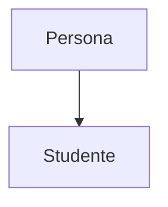
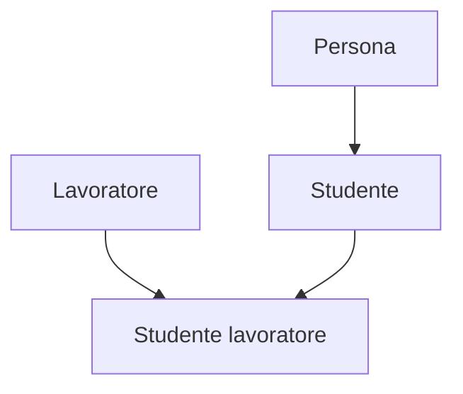

# Appendice D – principi di OOP

---

(
normalmente per ricevere un input diventa più comodo `argparse` anziché input.
è sostanzialmente un parser di argomenti. per ora meglio usare le variabili
anziché l'input.
)

---

in python troviamo il concetto di classe molto spesso.

un oggetto è un'istanza di una classe. per capire cos'è una classe, esempi.
immaginiamo di essere in un parcheggio e immaginiamo di voler rovinare un'auto.
tutte le auto hanno caratteristiche comuni, tutte hanno 4 ruote, accelerano, etc.
in un'aula, le persone sono simili, hanno delle caratteristiche fisiche in
comune.

immaginiamo di dover rappresentare due persone. la prima si chiama "Tizio Caio"
e l'altra "Gennaro Sempronio". che faccio? uso 4 variabili per memorizzare
nome e cognome? no. creo una struttura dati che racchiuda info dello stesso tipo.
abbiamo degli attributi tipo nome
e i metodi sono azioni sugli attributi.

sostanzialmente abbiamo una struttura dati che raggruppa le caratteristiche
generali di una classe. La classe è un'astrazione, cerchiamo di caratterizzare
un oggetto del mondo reale e estraiamo dei dati. Se la classe è "Persona",
un'istanza può essere "Angelo Cardellicchio", o il rettore "Boh chissene",

## Ereditarietà

implica che una classe possa discendere da un'altra. ad es. uno studente è una
persona però non è vero il contrario.



la classe "studente" deriva da "Persona". possiamo trovare altri insiemi
all'interno di "Studenti". l'Ereditarietà può essere multilivello o anche
multipla ovvero che eredita da più insiemi



## incapsulamento

mettiamo che io sia un programmatore e ho creato una classe persona col metodo
crea codice fiscale. voglio calcolare CF di una persona x. l'idea è che se la
classe ha dei metodi, uso il metodo calcola_cf e non mi interessa come funziona
in uscita mi da il codice fiscale. Mettiamo che un domani qualche rappresentante
vuole che nel codice fiscale non ci dev'essere più il cognome. ora come facciamo?
un sacco di programmatori usano la classe "persona", anziché ogni prog cambiare
il codice, lo cambio io e chi utilizza da fuori il programma non dovrà fare
niente quando succedono queste cose.

l'incapsulamento potrebbe far pensare alla sicurezza. non è così.
il codice pubblico è quello accessibile al programmatore, il privato solo
all'interno della classe,

## polimorfismo

classi diverse possono avere implementazioni differenti dello stesso metodo.

lasciando il nome del metodo uguale, a seconda della classe che utilizzo, il
metodo cambia.

---

# classi

si definiscono così:

```python
class NomeClasse(ClasseBase):
    # attributi e metodi della classe...
```

python ha una convenzione particolare, per le classi usa il CamelCase, sui metodi
usa la snake_convention.

normalmente le classi hanno un costruttore nei linguaggi di programmazione. in
python non c'è proprio zna cosa simile, c'è il metodo `__init__`.

`self` indica l'istanza della classe.

---

python non ha il controllo di tipo ma ha il type (h)inting(?)

---

PER CASA

provate ad estendere ??? con `argparse`
