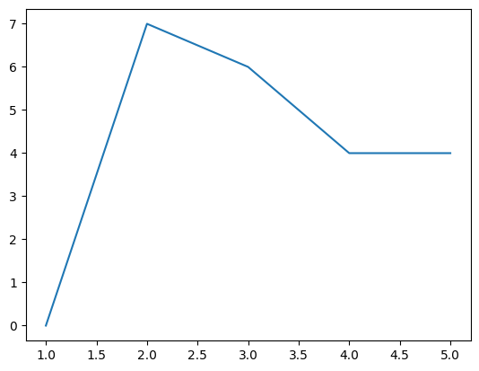
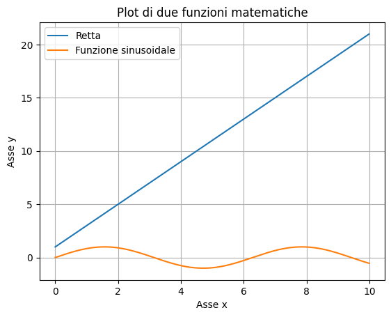
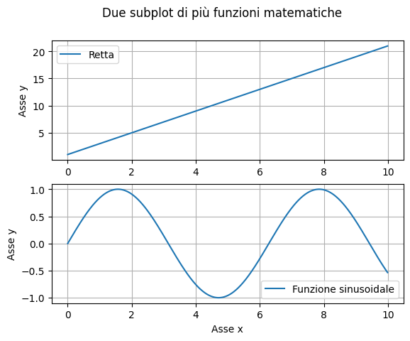
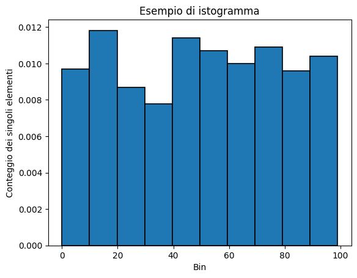

# 08 – Visualizzazione di dati

> Corso di Python per il Calcolo Scientifico
>
> Appunti redatti da Simone Fidanza, s.fidanza1@studenti.uniba.it

Angelo Cardellicchio, angelo.cardellicchio@stiima.cnr.it

<details>
    <summary>Outline</summary>

<a name="top"></a>

<!-- TOC -->

1. [08 – Visualizzazione di dati](#08--visualizzazione-di-dati)
   1. [Visualizzare i dati in Python (⮨)](#visualizzare-i-dati-in-python-)
      1. [Installazione della libreria (⮨)](#installazione-della-libreria-)
   2. [Il primo plot (⮨)](#il-primo-plot-)
   3. [Figure ed assi](#figure-ed-assi)
   4. [Esempi con Matplotlib (⮨)](#esempi-con-matplotlib-)
      1. [Plot di più Funzioni (⮨)](#plot-di-più-funzioni-)
      2. [Subplot (⮨)](#subplot-)
      3. [Rappresentazione di un istogramma (⮨)](#rappresentazione-di-un-istogramma-)

<!-- /TOC -->

</details>

## Visualizzare i dati in Python ([⮨](#top))

Finora ci siamo limitati a visualizzare dati e risultati ottenuti usando prima
la riga di comando, e poi i metodi forniti dai notebook Jupyter. Tuttavia, è
chiaro come questo modo di procedere sia limitante: cosa ne è di tutti i
coloratissimi grafici che possiamo ammirare in siti ed articoli scientifici?

Nella realtà, per ottenerli dovremo necessariamente integrare il nostro
ambiente di lavoro con altre librerie: ne esistono diverse, ma la più
importante ed utilizzata è senza ombra di dubbio
[Matplotlib](https://matplotlib.org), a cui si può affiancare
[Seaborn](https://seaborn.pydata.org), che tratteremo in una delle prossime
lezioni.

### Installazione della libreria ([⮨](#top))

Per prima cosa, installiamo le libreria. È possibile consultare le diverse
opzioni in appendice; qui riportiamo l'opzione di installazione mediante `pip`:

```sh
$ conda activate <my-env>
(<my-env>) ~$ pip install matplotlib
```

Per importare la libreria all'interno del nostro codice, usiamo un alias:

```python
import matplotlib.pyplot as plt
```

> <details open>
> <summary>ℹ️ <em>L'API <code>pyplot</code></em></summary>
>
> Sottolineamo l'uso dell'API [`pyplot`](https://matplotlib.org/stable/tutorials/introductory/pyplot.html)
> per Matplotlib al posto dell'API "standard". In tal modo, avremo a
> disposizione una serie di funzioni per il plot che ricorda molto quella usata
> dal MATLAB.
>
> </details>

## Il primo plot ([⮨](#top))

Dopo aver installato la libreria, proviamo a creare il nostro primo plot. Per
farlo, possiamo usare uno script, un terminale o un notebook, ed inserire il
seguente codice:

```python
import numpy as np
import matplotlib.pyplot as plt

rng = np.random.default_rng(42)
x = np.arange(1, 6)
y = rng.integers(low=0, high=10, size=5)

figure, axes = plt.subplots()

axes.plot(x, y)
plt.show()
```

Se tutto è andato per il verso giusto, dovremmo vedere a schermo questa
immagine:



> <details open>
> <summary>💡 <em>Suggerimento</em></summary>
>
> Dovreste vedere a schermo esattamente questa immagine perché nella
> generazione dei numeri casuali, viene usato il seed `42`. Se provate ad usarne
> un altro, vedrete un'altra immagine.
>
> </details>

Cerchiamo adesso di approfondire i concetti di funzionamento di Matplotlib.

## Figure ed assi

Alla base del funzionamento di Matplotlib abbiamo quattro classi fondamentali.

1. Le `Figure`, rappresentano l'intera figura mostrata da Matplotlib.
   Questa tiene traccia di tutto ciò che vi è al suo interno, e può contenere
   un numero arbitrario degli elementi che vedremo a breve;
2. Gli `Axes`, rappresentano il plot vero e proprio, ovvero la regione
   dell'immagine all'interno della quale vengono disegnati i dati. La relazione
   tra `Figure` ed `Axes` è strettamente gerarchica: una `Figure` può avere
   diversi `Axes`, ma ogni `Axes` appartiene esclusivamente ad una `Figure`;
3. All'interno di un oggetto `Axes` troviamo due o tre oggetti di tipo `Axis`,
   ognuno dei quali rappresenta l'asse vero e proprio (in altri termini $x$ e
   $y$, per le figure tridimensionali anche $z$). Gli oggetti `Axis` ci
   permettono quindi di definire gli intervalli dati, l'eventuale griglia, e
   via discorrendo;
4. In ultimo, abbiamo gli _artist_, che rappresentano tutto quello che è
   possibile visualizzare in una figura, incluso testo, label, plot, numeri,
   etc.

> <details>
> <summary>⚠️ <strong>Attenzione!</strong></summary>
>
> È importante non confondere gli `Axes` con gli `Axis`, nonostante la scelta
> dei nomi.
>
> </details>

Torniamo brevemente allo snippet precedente. Dopo aver importato i package
necessari e aver creato un vettore di numeri interi casuali, abbiamo creato una
`Figure` ed un `Axes` usando la funzione `subplots()`:

```python
figure, axes = plt.subplots()
```

A quel punto, abbiamo effettuato il plot dei valori di $x$ ed $y$ sul nostro
oggetto `Axes`:

```python
axes.plot(x, y)
```

In ultimo, abbiamo mostrato a schermo la figura usando la funzione `plt.show()`.

Vediamo altri esempi.

## Esempi con Matplotlib ([⮨](#top))

### Plot di più Funzioni ([⮨](#top))

Vogliamo mostrare sullo stesso `Axes` il plot di due diverse funzioni, in
particolare una retta e un seno. Questo è possibile grazie al fatto che i plot
vengono "gestiti" degli artist e quindi possiamo inserirne un numero arbitrario.

Per prima cosa, definiamo i nostri dati:

```python
x = np.arange(0., 10., 0.01)
y_1 = 1 + 2 * x
y_2 = np.sin(x)
```

Stiamo usando un unico vettore per le ascisse, di modo da fornire una base
comune al nostro plot. Adesso, creiamo la nostra `Figure` con relativo `Axes`,
ed effettuiamo il plot di entrambe le funzioni.

```python
figure, axes = plt.subplots()
axes.plot(x, y_1, label="Retta")
axes.plot(x, y_2, label="Funzione sinusoidale")
```

Abbiamo impostato un parametro `label` che indica l'etichetta assegnata ai due
plot, questa sarà utilizzata più tardi per generare la legenda. Impostiamo il
titolo e le label sugli assi $x$ ed $y$ usando rispettivamente le funzioni
`set_title()`, `set_xlabel()` e `set_ylabel()`:

```python
axes.set_title("Plot di due funzioni matematiche")
axes.set_xlabel("Asse x")
axes.set_ylabel("Asse y")
```

Usiamo la funzione `grid()` per mostrare una griglia sulla figura, e la
funzione `legend()` per far apparire la legenda che descrive le funzioni
visualizzate.

```python
axes.legend()
axes.grid()
```

Infine, mostriamo a schermo la figura con la funzione `show()`:

```python
plt.show()
```

Il risultato ottenuto è il seguente:



### Subplot ([⮨](#top))

Possiamo definire più `Axes` per un'unica `Figure`. Per farlo, possiamo
parametrizzare la funzione `subplots(i, j)`, in maniera tale che vengano
creati $i \times j$ plot all'interno della stessa figura.

Per creare due subplot, uno sopra l'altro, usiamo questa istruzione:

```python
figure, (axes_1, axes_2) = plt.subplots(2, 1)
```

Possiamo poi usare la funzione `suptitle()` per dare un titolo all'intera
figura:

```python
figure.suptitle("Due subplot di più funzioni matematiche")
```

A questo punto, procediamo ad effettuare i plot sui relativi assi nella solita
maniera:

```python
# Primo subplot
axes_1.plot(x, y_1, label="Retta")
axes_1.set_ylabel("Asse y")
axes_1.legend()
axes_1.grid()

# Secondo subplot
axes_2.plot(x, y_2, label="Funzione sinusoidale")
axes_2.set_xlabel("Asse x")
axes_2.set_ylabel("Asse y")
axes_2.legend()
axes_2.grid()

# Mostro la figura
plt.show()
```

Il risultato sarà simile a quello mostrato in figura:



### Rappresentazione di un istogramma ([⮨](#top))

Abbiamo già parlato degli istogrammi in precedenza. La loro vera potenza sta
nella rappresentazione visiva che offrono, in tal senso Matplotlib ci viene in
soccorso offrendoci la funzione `hist()`.

Per prima cosa, creiamo un vettore di interi.

```python
x = rng.integers(low=0, high=100, size=1000)
```

Creiamo la figura, usiamo la funzione `hist()` passandogli il vettore `x`
creato in precedenza e il parametro `density`, che ci permetterà di
normalizzare l'istogramma (ovvero, fare in modo che la sommatoria dei
singoli _bin_ sia esattamente pari ad $1$).

```python
figure, axes = plt.subplots()
axes.hist(x, edgecolor="black", linewidth=1.2, density=True)
```

Notiamo anche l'uso dei parametri `edgecolor` e `linewidth` che,
rispettivamente, permettono di cambiare il colore del bordo di ciascuna barra
dell'istogramma e specificare lo spessore di quest'ultima.

Usiamo i metodi opportuni per impostare titolo e label degli assi, e mostriamo
la figura.

```python
axes.set_xlabel("Bin")
axes.set_ylabel("Conteggio dei singoli elementi")
axes.set_title("Esempio di istogramma")

plt.show()
```

Il risultato sarà simile a questo:


