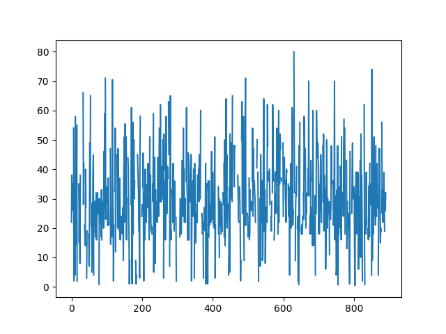
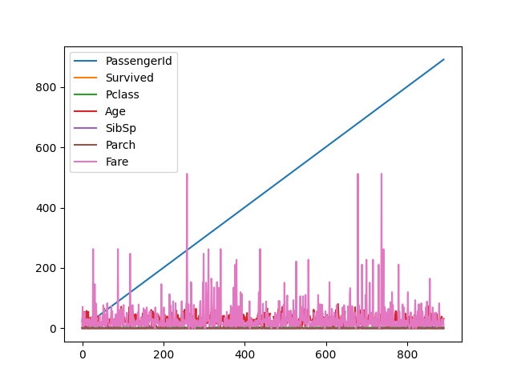
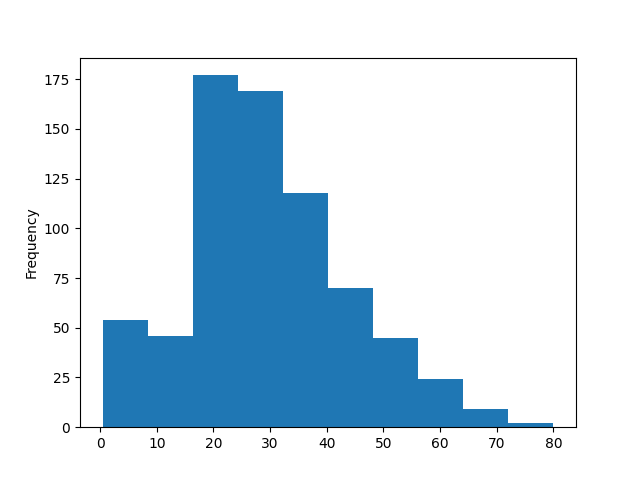

# 09 – Introduzione a pandas

> Corso di Python per il Calcolo Scientifico
>
> Appunti redatti da Simone Fidanza, s.fidanza1@studenti.uniba.it

Angelo Cardellicchio, angelo.cardellicchio@stiima.cnr.it

<details>
<summary>Outline</summary>

<!-- TOC -->

1. [09 – Introduzione a pandas](#09--introduzione-a-pandas)
   1. [Installazione e configurazione di Pandas](#installazione-e-configurazione-di-pandas)
2. [Pandas e la gestione dei dati](#pandas-e-la-gestione-dei-dati)
   1. [Le Series](#le-series)
      1. [Accesso agli elementi di una serie](#accesso-agli-elementi-di-una-serie)
      2. [Accesso agli elementi del dataframe](#accesso-agli-elementi-del-dataframe)
   2. [Maschere booleane](#maschere-booleane)
   3. [La funzione `groupby`](#la-funzione-groupby)
3. [Scrittura e lettura dei dataframe](#scrittura-e-lettura-dei-dataframe)
   1. [Lettura di dati da sorgenti eterogenee](#lettura-di-dati-da-sorgenti-eterogenee)
   2. [Scrittura di dati su destinazioni eterogenee](#scrittura-di-dati-su-destinazioni-eterogenee)
4. [Aggiunta di feature e dati](#aggiunta-di-feature-e-dati)
5. [Visualizzazione dei dati in Pandas](#visualizzazione-dei-dati-in-pandas)
6. [Operazioni statistiche sui dataframe](#operazioni-statistiche-sui-dataframe)

<!-- /TOC -->

</details>

Pandas è una delle librerie più importanti dell'ecosistema SciPy e viene usata
per lettura e elaborazione di dati provenienti da sorgenti di vario tipo, come
ad esempio file `CSV` o Excel, ma anche file `txt` e database.
Vediamo brevemente il funzionamento della libreria, ricordando che
approfondiremo l'utilizzo nelle lezioni successive.

## Installazione e configurazione di Pandas

Installiamo Pandas:

```sh
$ conda activate <my-env>
(<my-env>) ~$ pip install pandas
```

Come per le altre librerie, nel prosieguo presupporremo che Pandas sia già
stato importato nel nostro script/notebook:

```python
import pandas as pd
```

# Pandas e la gestione dei dati

Pandas gestisce prevalentemente dati strutturati sotto forma tabellare. Questi
sono simili a quelli comunemente contenuti nei fogli di calcolo o nei database.
Questi dati sono sicuramente tra i più diffusi ed utilizzati nell'analisi dati,
ovviamente escludendo le immagini: in tal senso, per modellarli, Pandas ci
mette a disposizione un'apposita struttura denominata dataframe.

I dataframe sono delle strutture che contengono dati di ogni tipo. Questi
sono normalmente organizzati in righe e colonne, proprio come sono organizzati
i fogli di calcolo e i database.
È importante sottolineare che per convenzione, le singole righe rappresentano i
campioni del dataset, mentre alle colonne sono associati i valori assunti dalle
diverse caratteristiche (o feature) di ciascun campione.

Facciamo un esempio usando il dataset Titanic, uno tra i più utilizzati a scopi
di sperimentazione. Per prima cosa, generiamo un dataframe rappresentativo dei
dati contenuti nel dataset:

```python
df = pd.read_csv("titanic.csv")
```

Usiamo il metodo `head()` per mostrare a schermo le prime cinque righe del
dataframe:

```pycon
>>> df.head()
   PassengerId  Survived  Pclass  ...     Fare Cabin  Embarked
0            1         0       3  ...   7.2500   NaN         S
1            2         1       1  ...  71.2833   C85         C
2            3         1       3  ...   7.9250   NaN         S
3            4         1       1  ...  53.1000  C123         S
4            5         0       3  ...   8.0500   NaN         S
```

Ad ogni passeggero sono associate delle feature, di cui possiamo inferire il
tipo (lo verificheremo a breve):

<!-- markdownlint-disable MD013 -->

| Feature     | Descrizione                                                       | Tipo            |
| :---------- | :---------------------------------------------------------------- | :-------------- |
| PassengerId | Identificativo univoco del passeggero.                            | Intero          |
| Survived    | Se è sopravvissuto.                                               | Intero/Booleano |
| Pclass      | Classe del passeggero                                             | Intero          |
| Name        | Nome completo                                                     | Stringa         |
| Sex         | Sesso                                                             | Stringa         |
| Age         | Età                                                               | Decimale        |
| SibSp       | "Siblings/Spouses": fratelli/coniugi a bordo per ogni passeggero. | Intero          |
| Parch       | "Parents/Children": genitori/figli a bordo per ogni passeggero.   | Intero          |
| Ticket      | Identificativo per il biglietto.                                  | Stringa         |
| Fare        | Tariffa pagata dal passeggero.                                    | Decimale        |
| Cabin       | Cabina in cui alloggiava il passeggero.                           | Stringa         |
| Embarked    | Punto di imbarco del passeggero.                                  | Stringa         |

<!-- markdownlint-enable MD013 -->

Verifichiamo che le nostre ipotesi sul tipo di dato siano corrette. Usiamo la
proprietà `dtypes` del dataframe:

```pycon
>>> df.dtypes
PassengerId      int64
Survived         int64
Pclass           int64
Name            object
Sex             object
Age            float64
SibSp            int64
Parch            int64
Ticket          object
Fare           float64
Cabin           object
Embarked        object
dtype: object
```

Notiamo subito la presenza di tre tipi di dati: `int64`, `float64` e `object`.
Mentre i primi due sono autoesplicativi, merita una particolare menzione il
tipo `object`. Questo viene associato automaticamente a tutte le stringhe.

> <details open>
> <summary>💡 <em>Suggerimento</em></summary>
>
> Usare il tipo `object` può comportare diversi problemi nella fase di analisi
> dei dati. È una buona idea parametrizzare la funzione `read_csv()` mediante
> il parametro [`dtype`](https://pandas.pydata.org/pandas-docs/stable/reference/api/pandas.read_csv.html).
> Questo accetta un dizionario che specifica il tipo di
> una o più colonne di dati. Ad esempio, se volessimo specificare che i nomi
> sono delle stringhe, potremmo usare il tipo `string`:
>
> ```pycon
> >>> types = {"Name": "string"}
> >>> df = pd.read_csv("train.csv", dtype=types)
> >>> df.dtypes
> # ...
> Name            string
> # ...
> ```
>
> </details>

Il dataset ci illustra numerose proprietà per ogni passeggero imbarcato. Queste
potranno essere utilizzate per un'analisi approfondita della struttura dei dati
sotto diversi aspetti e punti di vista; ne parleremo più ampiamente in
seguito.

## Le Series

Ogni dataframe è in realtà composto da diverse colonne, ciascuna
rappresentativa di una feature specifica.
Nella pratica, Pandas ci offre un modo per rappresentare singolarmente ciascuna
di queste colonne, mediante un oggetto di classe `Series`. Ad esempio, potremmo
estrarre la serie relativa agli identificativi numerici dei passeggeri:

```pycon
>>> names = df["Name"]
>>> names.head()
0                              Braund, Mr. Owen Harris
1    Cumings, Mrs. John Bradley (Florence Briggs Th...
2                               Heikkinen, Miss. Laina
3         Futrelle, Mrs. Jacques Heath (Lily May Peel)
4                             Allen, Mr. William Henry
Name: Name, dtype: object
```

### Accesso agli elementi di una serie

Possiamo accedere ad un singolo elemento di una serie mediante una classica
procedura di indicizzazione. Ad ogni campione all'interno della serie viene
associato ad un indice numerico crescente, il cui valore iniziale è pari a 0;
pertanto, possiamo accedere all'𝒊-mo elemento della serie richiamando l'𝒊-mo
indice, esattamente come accade per le liste o le sequenze:

```pycon
>>> names[0]
'Braund, Mr. Owen Harris'
```

> <details>
> <summary>✏️ <strong>Nota</strong></summary>
>
> L'indicizzazione può essere anche usata per impostare il valore associato ad
> uno specifico indice della serie.
>
> </details>

### Accesso agli elementi del dataframe

L'accesso agli elementi del dataframe può avvenire attraverso diverse modalità.
Possiamo accedere allo specifico valore di una feature di un dato campione
mediante il _chained indexing_:

```pycon
>>> df["Age"][1]
38.0
```

In alternativa, è possibile usare la funzione `loc(row_idx, col)`, che permette
di accedere al valore assunto dalla feature `col` per l'elemento in posizione `row_idx`:

```pycon
>>> df.loc[1, ("Age")]
38.0
```

La funzione `loc()` può operare anche su degli slice di dati:

```pycon
>>> df.loc[1:5, ("Age")]
1    38.0
2    26.0
3    35.0
4    35.0
5     NaN
Name: Age, dtype: float64
```

o su insiemi di feature:

```pycon
>>> df.loc[1:5, ("Age", "Sex")]
    Age     Sex
1  38.0  female
2  26.0  female
3  35.0  female
4  35.0    male
5   NaN    male
```

La funzione `loc()` opera sugli indici di riga. In questo caso, il nostro
dataframe ha degli indici di riga interi, assegnati automaticamente in fase di
lettura del dataframe. Nel caso decidessimo di usare una colonna del dataframe
come indice, potremmo usare il metodo `set_index()`:

```pycon
>>> df = df.set_index("Ticket")
```

Le funzioni lavorano sul valore e non sulla reference. Di conseguenza, se
omettessimo l'assegnazione, `df` rimarrebbe invariato. Un modo per evitare di
usare ogni volta l'operazione di assegnazione è quello di impostare il
parametro `inplace` a `True`:

```pycon
>>> df.set_index("Ticket", inplace=True)
```

In alternativa, possiamo decidere di impostare l'indice direttamente nel
`read_csv()` impostando il parametro `index_col`:

```pycon
>>> df = pd.read_csv("titanic.csv", index_col="Ticket")
```

In questo caso, la funzione loc dovrà essere utilizzata usando come parametri
di lettura per righe i nuovi indici. Ad esempio:

```pycon
>>> df.loc["STON/O2. 3101282", "Name"]
'Heikkinen, Miss. Laina'
```

Oltre alla funzione `loc()`, Pandas ci mette a disposizione la funzione
`iloc()`, la quale permette di selezionare un sottoinsieme di campioni del
dataframe mediante indici interi (da cui la i):

```pycon
>>> df.iloc[2:5, 2:4]
                  Pclass                                          Name
Ticket
STON/O2. 3101282       3                        Heikkinen, Miss. Laina
113803                 1  Futrelle, Mrs. Jacques Heath (Lily May Peel)
373450                 3                      Allen, Mr. William Henry
```

## Maschere booleane

Supponiamo di voler selezionare soltanto gli uomini maggiorenni presenti nel
dataset del Titanic. Per farlo, possiamo usare un'istruzione che implementi
delle logiche di tipo booleano:

```pycon
>>> men = df[(df["Age"] > 18) & (df["Sex"] == "male")]
>>> men.head()
           PassengerId  Survived  Pclass  ...     Fare Cabin  Embarked
Ticket                                    ...
A/5 21171            1         0       3  ...   7.2500   NaN         S
373450               5         0       3  ...   8.0500   NaN         S
17463                7         0       1  ...  51.8625   E46         S
A/5. 2151           13         0       3  ...   8.0500   NaN         S
347082              14         0       3  ...  31.2750   NaN         S

[5 rows x 11 columns]
```

Nella pratica, stiamo filtrando il dataset in base all'`AND` logico tra due
condizioni:

- `df["Age"] > 18`: questa condizione genera una maschera booleana che è `True`
  soltanto se l'età per quel passeggero è maggiore di 18;
- `df["Sex"] == "male"`: questa condizione genera una maschera booleana che è
  vera soltanto se il sesso del passeggero è maschile.

## La funzione `groupby`

Possiamo sfruttare la funzione [`groupby`](https://pandas.pydata.org/pandas-docs/stable/reference/api/pandas.DataFrame.groupby.html)
per raggruppare insiemi di dati (normalmente pertinenti a _categorie_).

Ad esempio, potremmo raggruppare i passeggeri per sesso:

```pycon
>>> df.groupby(["Sex"])
<pandas.core.groupby.generic.DataFrameGroupBy object at 0x0000017B6B6355B0>
```

Possiamo estrarre delle statistiche a partire da questi raggruppamenti.
Vediamo, ad esempio, l'età media dei passeggeri di sesso femminile e maschile:

```pycon
>>> df.groupby(["Sex"])["Age"].mean()
Sex
female    27.915709
male      30.726645
Name: Age, dtype: float64
```

# Scrittura e lettura dei dataframe

## Lettura di dati da sorgenti eterogenee

Nel nostro primo esempio abbiamo usato la funzione `read_csv()` per creare un
dataframe a partire da i dati memorizzati in un file di formato `CSV`.
Tuttavia, Pandas supporta molti altri formati.

Ad esempio, potremmo provare a leggere un file `xlsx` (Excel):

```python
df = pd.read_excel("dati.xlsx")
```

> <details open>
> <summary>⚠️ <strong>Attenzione!</strong></summary>
>
> Sia per leggere, che per scrivere file di Excel è necessario installare la
> libreria `openpyxl` (`pip install openpyxl`)
>
> </details>

In alternativa, possiamo leggere un file `JSON`, oppure ancora un database:

```python
df = pd.read_json("dati.json")
df = pd.read_sql(SQL_QUERY)
```

Esiste un elenco completo delle numerose funzioni disponibili, che possono
essere individuate sulla [reference](https://pandas.pydata.org/pandas-docs/stable/reference/io.html).
In generale, la sintassi è sempre `read_<type>(<data-source>)`, dove `<type>`
è il tipo di sorgente dati (`csv`, `excel`, etc)

## Scrittura di dati su destinazioni eterogenee

Possiamo scrivere un dataframe su file mediante le funzioni duali alle
`read_<type>()`, che usano il suffisso `to_<type>()` seguito dall'estensione
del file destinazione. Ad esempio, potremmo scrivere un file `CSV` con il
metodo `to_csv()`:

```python
df.to_csv("train.xlsx")
```

# Aggiunta di feature e dati

Immaginiamo di voler aggiungere una nuova feature ad un dataframe già
esistente. Per farlo, iniziamo creando un dataframe da zero:

```pycon
>>> df = pd.DataFrame([1, 2, 3, 4, 5], columns=["one"])
>>> df
   one
0    1
1    2
2    3
3    4
4    5
```

Possiamo aggiungere una nuova colonna semplicemente usando l'operatore di
assegnazione e specificandone il nome:

```pycon
>>> df["two"] = df["one"] * 2
>>> df
   one  two
0    1    2
1    2    4
2    3    6
3    4    8
4    5   10
```

Possiamo inserire nuovi campioni in coda al dataframe. Per farlo, dovremo prima
creare un nuovo dataframe dalle dimensioni coerenti con quello già esistente, e
poi usare la funzione `concat()`:

```pycon
>>> df_add = pd.DataFrame([[6, 7]], columns=["one", "two"])
>>> df = pd.concat([df, df_add])
>>> df
   one  two
0    1    2
1    2    4
2    3    6
3    4    8
4    5   10
0    6    7
```

La funzione `concat()` accetta, tra gli altri, il parametro `axis`. Se questo è
uguale a zero (come lo è di default), `concat()` effettua la concatenazione per
righe; se è pari ad 1, invece, la concatenazione avviene per colonne. Tuttavia,
è importante sottolineare come la concatenazione avvenga anche nel caso le
misure non siano completamente coerenti: infatti, se provassimo ad effettuare
una concatenazione per colonne, avremmo un risultato del tipo:

```pycon
>>> pd.concat([df, df_add], axis=1)
   one  two  one  two
0    1    2  6.0  7.0
1    2    4  NaN  NaN
2    3    6  NaN  NaN
3    4    8  NaN  NaN
4    5   10  NaN  NaN
0    6    7  6.0  7.0
```

I valori relativi alle righe con indice che va da 1 a 4, che ovviamente non
saranno presenti, saranno automaticamente impostati a `NaN`, acronimo di _Not a_
_Number_.

# Visualizzazione dei dati in Pandas

Pandas offre un supporto nativo a Matplotlib per permettere la visualizzazione
dei dati contenuti all'interno di un dataframe.

In tal senso, possiamo usare la funzione `plot()` su una serie o su un intero
dataframe; ad esempio, potremmo effettuare il plot delle età dei passeggeri:

```pycon
>>> df["Age"].plot()
<AxesSubplot:>
>>> plt.show()
```

ottenendo il risultato mostrato in figura:



Possiamo anche fare il plot dell'intero `DataFrame`:

```pycon
>>> df.plot()
<AxesSubplot:>
>>> plt.show()
```



Ovviamente, è possibile usare Pandas anche per fare il plot di altri tipi di
grafico, come ad esempio gli istogrammi. Per farlo, si usano le apposite
sotto-funzioni di `plot`:

```pycon
>>> df["Age"].plot.hist()
<AxesSubplot:ylabel='Frequency'>
>>> plt.show()
```

Otterremo:



> <details open>
> <summary>ℹ️ <em>Pandas e Seaborn</em></summary>
>
> Pandas si integra in maniera naturale con la libreria Seaborn, di cui
> tratteremo nella prossima lezione.
>
> </details>

# Operazioni statistiche sui dataframe

Pandas mette a disposizione delle funzioni, simili a quelle offerte da NumPy,
per calcolare delle statistiche per ciascuna delle colonne presenti in un
`DataFrame`. Ad esempio:

```pycon
>>> df.mean(numeric_only=True)
PassengerId    446.000000
Survived         0.383838
Pclass           2.308642
Age             29.699118
SibSp            0.523008
Parch            0.381594
Fare            32.204208
dtype: float64
```

> <details open>
> <summary>✏️ <strong>Nota</strong></summary>
>
> Usiamo `numeric_only=True` poiché alcuni valori non sono numerici, come il
> sesso, il ticket, etc. Per evitare errori, effettuiamo la media solo su valori
> numerici.
>
> </details>

Esistono funzioni anche per calcolare varianza (`.var()`), mediana
(`.median()`), deviazione standard (`.std()`), e via discorrendo.

Particolarmente interessante è la funzione `describe()`, che ci mostra tutte le
statistiche più significative per ognuna delle feature considerate: cosa

<!-- markdownlint-disable MD013 -->

```pycon
>>> df.describe()
       PassengerId    Survived      Pclass         Age       SibSp       Parch        Fare
count   891.000000  891.000000  891.000000  714.000000  891.000000  891.000000  891.000000
mean    446.000000    0.383838    2.308642   29.699118    0.523008    0.381594   32.204208
std     257.353842    0.486592    0.836071   14.526497    1.102743    0.806057   49.693429
min       1.000000    0.000000    1.000000    0.420000    0.000000    0.000000    0.000000
25%     223.500000    0.000000    2.000000   20.125000    0.000000    0.000000    7.910400
50%     446.000000    0.000000    3.000000   28.000000    0.000000    0.000000   14.454200
75%     668.500000    1.000000    3.000000   38.000000    1.000000    0.000000   31.000000
max     891.000000    1.000000    3.000000   80.000000    8.000000    6.000000  512.329200
```

<!-- markdownlint-enable MD013 -->
