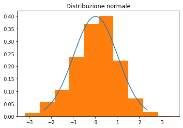
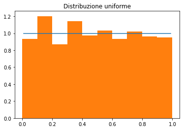
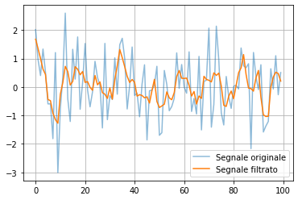

# 11 – Introduzione a SciPy

> Corso di Python per il Calcolo Scientifico
>
> Appunti redatti da Simone Fidanza, s.fidanza1@studenti.uniba.it

Angelo Cardellicchio, angelo.cardellicchio@stiima.cnr.it

<details>
<summary>Outline</summary>

<!-- TOC -->

1. [11 – Introduzione a SciPy](#11--introduzione-a-scipy)
2. [L'ecosistema SciPy](#lecosistema-scipy)
3. [La libreria SciPy](#la-libreria-scipy)
4. [Validazione empirica di due distribuzioni](#validazione-empirica-di-due-distribuzioni)
5. [Calcolo del determinate e inversa di una matrice](#calcolo-del-determinate-e-inversa-di-una-matrice)
6. [Filtraggio di un segnale](#filtraggio-di-un-segnale)

<!-- /TOC -->

</details>

# L'ecosistema SciPy

Ai lettori più attenti può apparire evidente come tutte le librerie viste
finora facciano parte di una sorta di ecosistema pensato per permettere
un'interazione tra tipi e classi il quanto più possibile semplice e coesa.

Questo è dovuto al fatto che librerie come NumPy, Matplotlib, Pandas e Seaborn
fanno tutte parte di un unico ecosistema chiamato SciPy, pensato per dare delle
fondamenta comuni su cui costruire l'intera disciplina del calcolo scientifico
in Python.

Tuttavia, abbiamo omesso una delle librerie fondamentali di questo ecosistema,
talmente importante che prende il nome del framework stesso: ovviamente, stiamo
parlando della libreria SciPy.

# La libreria SciPy

La libreria SciPy presenta un [vastissimo insieme di algoritmi e funzioni matematiche](https://docs.scipy.org/doc/scipy/reference/)
costruite a partire dagli oggetti definiti da NumPy.

Al solito, la libreria va installata usando ad esempio `pip`:

```sh
$ conda activate <my-env>
(<my-env>) ~$ pip install scipy
```

In questa brevissima introduzione, vedremo alcune delle potenzialità
di SciPy, basandoci su un paio di casi d'uso (più o meno) reali.

# Validazione empirica di due distribuzioni

Vediamo come comparare visivamente il valore teorico assunto da due
distribuzioni di probabilità "standard" (ovvero la uniforme e la normale) e
l'istogramma ottenuto a partire da un elevato numero di elementi generati
casualmente ma appartenenti a quella distribuzione.

In primis, iniziamo importando i moduli `norm` e `uniform` dal package `stats`,
atti a modellare tutte le istruzioni riguardanti le distribuzioni normali e
uniformi:

```python
from scipy.stats import norm, uniform
```

Generiamo adesso 100 campioni equidistanti e compresi tra l'1 ed il 99
percentile delle distribuzioni (considerando numpy già importato):

```python
x_1 = np.linspace(norm.ppf(0.01), norm.ppf(0.99), 100)
x_2 = np.linspace(uniform.ppf(0.01), uniform.ppf(0.99), 100)
```

Stiamo usando la funzione `linspace()` per generare dei campioni equidistanti
tra loro, compresi tra `dist.ppf(0.01)` e `dist.ppf(0.99)`. L'oggetto `dist`
può essere sia `norm` che `uniform`, mentre `ppf(0.01)` rappresenta
l'1-percentile della distribuzione (e, analogamente, `ppf(0.99)` rappresenta il
99-percentile). In parole povere, stiamo generando cento campioni equidistanti
tra l'1-percentile ed il 99-percentile della distribuzione `dist`.

Successivamente, utilizziamo la funzione `rvs()` per generare casualmente un
numero di valori che però siano distribuiti secondo le due distribuzioni
considerate:

```python
r_1 = norm.rvs(size=1000)
r_2 = uniform.rvs(size=1000)
```

A questo punto, possiamo effettuare il plot dell'istogramma dei valori `r_i`, e
verificare che segua la distribuzione di probabilità `pdf(x)` per ciascuno dei
due tipi di distribuzione. Ricordiamo di inserire il valore `density=True` per
normalizzare l'istogramma.

Per la distribuzione normale:

```python
plt.plot(x_1, norm.pdf(x_1))
plt.hist(r_1, density=True)
plt.title("Distribuzione normale")
plt.show()
```

e otterremo:



Mentre per la distribuzione uniforme:

```python
plt.plot(x_2, uniform.pdf(x_2))
plt.hist(r_2, density=True)
plt.title("Distribuzione uniforme")
plt.show()
```

e otterremo:



# Calcolo del determinate e inversa di una matrice

SciPy offre anche la possibilità di effettuare calcoli algebrici grazie ad un
numero di funzioni molto più elevato rispetto a quelle presenti in NumPy.

Per fare un rapido esempio, vediamo come è possibile calcolare il determinante
e l'inversa di una matrice.

```python
from scipy import linalg

mat = np.array([[1, 5, 3], [0, 1, 3], [2, 2, 4]])
d = linalg.det(mat)
i = linalg.inv(mat)
```

> <details>
> <summary>✏️ <strong>Nota</strong></summary>
>
> È molto semplice notare come la sintassi richiami quella di NumPy e, in
> realtà, anche il funzionamento sia il medesimo, per cui è possibile usare
> indifferentemente entrambe le librerie. Dove SciPy spicca è in tutte quelle
> funzioni che non sono presenti in NumPy.
>
> </details>

# Filtraggio di un segnale

SciPy ha al suo interno diverse librerie per l'elaborazione dei segnali a
diverse dimensionalità.

Per fare un esempio, proviamo ad utilizzare un filtro di Savitzky-Golay su un
array monodimensionale mediante la funzione [`savgol_filter()`](https://docs.scipy.org/doc/scipy/reference/generated/scipy.signal.savgol_filter.html).

Creiamo un array casuale mediante NumPy:

```python
noisy = np.random.normal(0, 1, size=(100,))
```

Filtriamo questo segnale usando un filtro di Savitzky-Golay con finestra di
lunghezza pari a $7$ campioni e mediante un polinomio approssimante di secondo
grado:

```python
from scipy.signal import savgol_filter

filtered = savgol_filter(noisy, 7, 2)
```

Creiamo il plot:

```python
plt.plot(np.arange(100), noisy, alpha=0.5, label='Segnale originale')
plt.plot(np.arange(100), filtered, label='Segnale filtrato')
plt.grid()
plt.legend()
plt.show()
```

e otterremo un risultato come questo:


