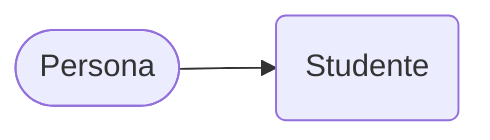

# Appendice D – Principi di Programmazione orientata agli oggetti

> Corso di Python per il Calcolo Scientifico
>
> Appunti redatti da Simone Fidanza, s.fidanza1@studenti.uniba.it

Angelo Cardellicchio, angelo.cardellicchio@stiima.cnr.it

Outline

<!-- TOC -->

1. [Appendice D – Principi di Programmazione orientata agli oggetti](#appendice-d--principi-di-programmazione-orientata-agli-oggetti)
   1. [D.1 – La classe `Persona`](#d1--la-classe-persona)
      1. [D.1.1 – Ereditarietà](#d11--ereditarietà)
      2. [D.1.2 – Incapsulamento](#d12--incapsulamento)
      3. [D.1.3 – Polimorfismo](#d13--polimorfismo)

<!-- /TOC -->

La programmazione orientata agli oggetti (_object-oriented programming_, OOP) è
un paradigma di programmazione che sposta il _focus_ dalle funzioni ai **dati**.
In particolare la OOP prevede che tutto sia un oggetto: una variabile è un
oggetto e in alcuni linguaggi perfino le funzioni.

Questo viene ovviamente esteso anche ai tipi definiti dall'utente, che assumono
il nome di _classi_. Facciamo un esempio.

## D.1 – La classe `Persona`

Immaginiamo di voler definire una struttura dati che contenga al suo interno
delle informazioni utili a definire una persona, ad esempio: nome, cognome,
sesso e età. Per farlo sarà necessario usare diversi dati primitivi: una
stringa per nome, cognome e sesso, un intero per l'età.

Possiamo creare quindi la classe `Persona` che avrà quattro attributi:

| Attributo | Tipo            |
| :-------- | :-------------- |
| `nome`    | stringa – `str` |
| `cognome` | stringa – `str` |
| `genere`  | stringa – `str` |
| `età`     | intero – `int`  |

Sottolineamo che questa classe rappresenta tutte le possibili persone: infatti,
si cerca di creare delle strutture dati generiche, che abbiano degli attributi
comuni a tutte le possibili istanze. In questo caso sappiamo che ogni persona ha
un nome, un cognome, un sesso e un'età. Usiamo quindi questi quattro valori come
attributi di classe.

> 

> 
ℹ️ <em>Differenza tra classe ed istanza</em>

>
> Una classe rappresenta tutte le possibili istanze della stessa. Dunque, nel
> nostro esempio, la classe `Persona` è in grado di rappresentare tutte le
> persone, mentre un'istanza della classe Persona è una singola variabile o
> oggetto che rappresenta la persona.
>
> 

Ovviamente possiamo agire con degli opportuni metodi su questi attributi. Ad
esempio, se avessimo a disposizione anche il luogo e la data di nascita potremmo
creare un metodo `calcola_CF()` che permetta di generare il codice fiscale di
una singola istanza.

Oltre il concetto di classe, la OOP definisce altri tre concetti. Vediamoli.

### D.1.1 – Ereditarietà

Per **_ereditarietà_** si intende la capacità di una classe di "discendere" da
un'altra. Una classe figlia eredita **tutte** le caratteristiche della classe
madre.

Possiamo, ad esempio, definire la classe `Studente` come figlia della classe
`Persona` a cui aggiungeremo i seguenti attributi:

| Attributo   | Tipo            |
| :---------- | :-------------- |
| `matricola` | stringa – `str` |
| `libretto`  | stringa – `str` |

Possiamo visualizzare questa relazione in ordine gerarchico come segue:

Dunque la classe `Studente` deriva da `Persona`. All'interno della classe
`Studente` possiamo trovare altri insiemi poiché l'ereditarietà è sia
multilivello che multipla (ovvero eredità da più insiemi):

> 

> 
💡 <em>Suggerimento</em>

>
> Alcuni linguaggi, compreso Python, offrono la possibilità di ereditare da più
> classi; tale concetto è chiamato **_ereditarietà multipla_**. Se invece
> stabiliamo una vera e propria gerarchia di classi, con una classe "nonna", una
> "madre" ed una "figlia", avremo una struttura multilivello.
>
> 

Notiamo che la classe `Studente` può anche aggiungere metodi, oltre che
attributi, a quelli offerti da `Persona` come ad esempio `genera_media_voto()`.

In ultimo, notiamo come ogni istanza di `Studente` è un'istanza di `Persona`, ma
non è vero il contrario, quindi non tutte le persone sono studenti. Per
comprendere meglio il concetto visualizziamo gli insiemi delle istanze di
`Persona` e `Studente`:

> 

> 
ℹ️ <em>Generalizzazione e specializzazione</em>

>
> La relazione di ereditarietà può anche essere vista in termini di
> _generalizzazione_ e _specializzazione_. In questo contesto la classe
> `Studente` è una _specializzazione_ di `Persona` perché sottende ad un insieme
> più specifico. Al contrario, le persone sono viste come una _generalizzazione_
> degli studenti.
>
> 

### D.1.2 – Incapsulamento

Il concetto di _incapsulamento_ prevede che sia possibile accedere ad un metodo
(o un attributo) di una classe esclusivamente mediante la sua interfaccia.

Immaginiamo di voler calcolare il codice fiscale di una persona: dovremo seguire
una procedura ben precisa e moderatamente complessa, che potremo tranquillamente
"nascondere" all'utilizzatore finale che dovrà invocare semplicemente il metodo
`calcola_CF()`. Tuttavia, se volessimo seguire il principio di modularità, che
suggerisce di suddividere le funzioni complesse per renderle più semplici,
dovremmo creare delle funzioni ausiliarie che potrebbero calcolare la
rappresentazione di nome e cognome (`calcola_nc()`) e i dati alfanumerici
derivanti da luogo e data di nascita (`calcola_ld()`). Ovviamente, non vi è
alcun bisogno di accedere a questi metodi dall'esterno della classe, in quanto
hanno valenza esclusiva nell'ambito del calcolo del codice fiscale e per questo
motivo li si potrà dichiarare come privati e vi si potrà accedere soltanto
dall'interno della classe.

In questo modo la classe mantiene un'interfaccia stabile e essenziale: il codice
che usa la classe avrà sempre un punto di accesso ben definito e, nel caso in cui
sia necessario modificare dei comportamenti interni alla classe, questo non verrà
influenzato dalle modifiche. Ad esempio, se per qualche motivo si decidesse di
invertire l'ordine di nome e cognome all'interno del codice fiscale, basterebbe
modificare il metodo `calcola_nc()` e il resto dell'implementazione (sia della
classe che del codice chiamante) non ne sarebbe influenzata.

Dove "INT "sta per interno e "EXT" per esterno.

### D.1.3 – Polimorfismo

Il concetto di polimorfismo prevede che sia possibile modificare il comportamento
associato ad un metodo a seconda della classe che lo utilizza.

Immaginiamo di specializzare la classe `Studente` in due ulteriori
rappresentazioni, ovvero `StudenteUniversitario` e `StudenteScolastico`.
Ovviamente il metodo `genera_media_voto()` verrà ereditato da entrambe le classi;
tuttavia, l'implementazione dovrà essere **differente** poiché la media del voto
di laurea è pesata in modo differente rispetto alla media aritmetica usata nelle
scuole fino alla secondaria.

Il polimorfismo ci permette di raggiungere questo obiettivo. Possiamo effettuare
una procedura di _override_ del metodo `genera_media_voto()` che, pur conservando
la stessa firma avrà differenti implementazioni nelle classi
`StudenteUniversitario` e `StudenteScolastico`. La conservazione della firma
presenta un vantaggio paragonabile a quello ottenuto dal polimorfismo: infatti
un programmatore userà il metodo `genera_media_voto()` allo stesso modo, sia per
uno studente universitario che per uno studente di scuola media, senza dover
tenere a mente due interfacce differenti.

