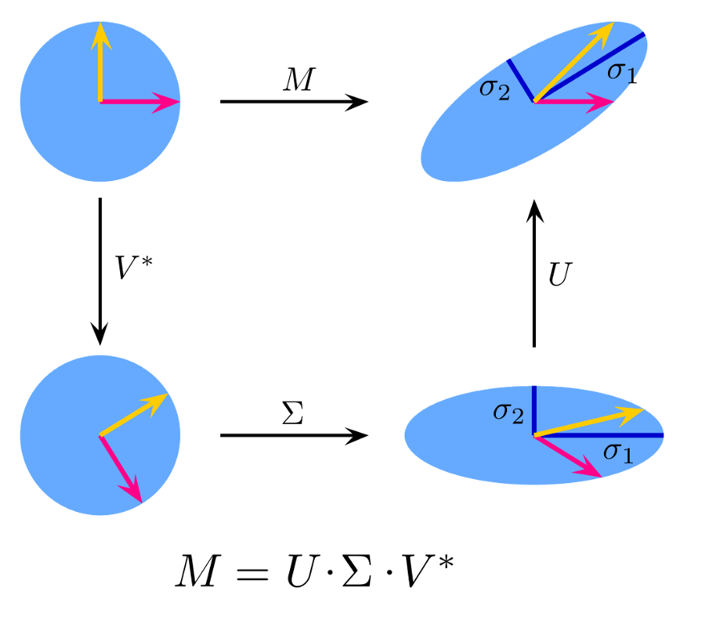

# Appendice G – Algoritmi

> Corso di Python per il Calcolo Scientifico
>
> Appunti redatti da Simone Fidanza, s.fidanza1@studenti.uniba.it

Angelo Cardellicchio, angelo.cardellicchio@stiima.cnr.it

Outline

<!-- TOC -->

1. [Appendice G – Algoritmi](#appendice-g--algoritmi)
2. [G.1 – Decomposizione ai valori singolari](#g1--decomposizione-ai-valori-singolari)
   1. [G1.2 – Trasformazione 1: rescaling di matrice](#g12--trasformazione-1-rescaling-di-matrice)
   2. [G.1.3 – Trasformazione 2: rotazione di matrice](#g13--trasformazione-2-rotazione-di-matrice)
   3. [G.1.4 – Interpretazione della SVD](#g14--interpretazione-della-svd)

<!-- /TOC -->

# G.1 – Decomposizione ai valori singolari

La **decomposizione ai valori singolari** (_singular value decomposition_, SVD)
è una tecnica di _decomposizione matriciale_ che permette di trovare un
prodotto di matrici che equivalga alla matrice iniziale.

Data una matrice $M$ reale o complessa di dimensione $m\times n$, si tratta di
una scrittura del tipo:

$$
M = U\Sigma V^*
$$

dove:

- $U$ è una matrice unitaria di dimensioni $m\times m$;
- $\Sigma$ è una matrice diagonale rettangolare di dimensioni $m\times n$;
- $V^*$ è la trasposta coniugata di una matrice unitaria $V$ di
  dimensioni $n\times n$.

Inoltre:

- $U$ e $V$ sono matrici ortogonali, per cui $U^\top = U^{-1}$ e $V^\top = V^{-1}$;
- $\Sigma$ è una matrice diagonale _non necessariamente quadrata_.

Prima di dare una definizione intuitiva di SVD, però, è opportuno introdurre il
concetto di trasformazione lineare.

## G1.2 – Trasformazione 1: rescaling di matrice

Applichiamo al vettore $v$ una trasformazione lineare definita da una matrice
diagonale $d$:

$$
\newcommand{\mtrx}[2]{\begin{bmatrix}#1 \\ #2\end{bmatrix}}

\begin{align*}
    v &= \mtrx{x}{y} \\
    d &= \mtrx{3 & 0}{0 & 3} \\
\end{align*}
$$

Se moltiplichiamo $d$ per $v$, abbiamo:

$$
\newcommand{\mtrx}[2]{\begin{bmatrix}#1 \\ #2\end{bmatrix}}

\mtrx{x'}{y'} = \mtrx{3 & 0}{0 & 3} \times \mtrx{x}{y}
              = \mtrx{3x + 0}{0 + 3y}
              = \mtrx{3x}{3y}
$$

In pratica, abbiamo triplicato il nostro vettore!

## G.1.3 – Trasformazione 2: rotazione di matrice

Laddove le matrici diagonali sono normalmente utilizzate per effettuare un
rescaling, le matrici non diagonali possono essere usate per indurre una
rotazione su un vettore. Ad esempio, possiamo pensare ad una matrice $R$ di
questo tipo:

$$
R = \begin{bmatrix}
        \cos{\vartheta} & \sin{\vartheta} \\
        \sin{\vartheta} & \cos{\vartheta}
    \end{bmatrix}
$$

Se applicata ad un vettore, questa matrice applicherà una certa rotazione a $\vartheta$:

$\newcommand{\mtrx}[2]{\begin{bmatrix}#1 \\ #2\end{bmatrix}}
\displaystyle
\mtrx{x'}{y'} = \mtrx{x\cos{\vartheta} + y\sin{\vartheta}}{x\sin{\vartheta} + y\cos{\vartheta}}$

Se consideriamo un vettore a coordinate $x = 1, y = 0$, e un valore di
$\vartheta$ pari a $45^\circ$, allora

$$
    x' = 1 \cdot \cos(45) + 0 \cdot \sin(45) = \cos(45)
$$

e

$$
    y' = 1 \cdot \sin(45) + 0 \cdot \cos(45) = \sin(45)
$$

In questo caso specifico, i nuovi valori di $(x', y')$ saranno pari a
$\sqrt{2}/2$, per cui avremo ruotato il nostro punto originario di $45^\circ$.

## G.1.4 – Interpretazione della SVD

Possiamo quindi adesso applicare le nozioni viste in precedenza per
"comprendere" la SVD, che può essere vista come una serie di _trasformazioni_
_lineari_.

In particolare, se partissimo dal cerchio di raggio unitario, e applicassimo le
trasformazioni lineari imposte da una generica matrice $M$, avremmo una certa
trasformazione delle coordinate definite sul cerchio. Mediante le tre diverse
matrici definite dalla SVD _scomponiamo linearmente_ in tre passi questa
trasformazione, imponendo prima una rotazione, poi uno scaling e poi un'ultima
rotazione. Ciò implica che _il prodotto delle tre matrici in uscita dalla SVD_
_applica una trasformazione lineare equivalente a quella applicata dalla sola_
_matrice_ $M$.

Questo concetto è riassunto nella seguente figura.

Il ruolo principale della SVD è quindi quello di definire una serie di _valori_
_singolari_ (la matrice $\Sigma$) di una matrice $M$, i quali possono essere
ricondotti ai valori originari mediante trasformazioni lineari. In tal senso,
se la matrice originaria rappresenta un insieme di feature per un dato dataset,
i valori singolari rappresentano un nuovo insieme di queste feature,
corrispondenti ad una combinazione lineare di quelle originarie, ordinati
secondo il grado di variabilità dei dati originari che riescono a
"rappresentare", o "spiegare".

Ne consegue che se un numero ridotto di feature individuate dalla SVD riesce a
rappresentare un buon grado di variabilità dei dati iniziali, è possibile
scartare le feature rimanenti, effettuando quindi un'operazione di _riduzione_
_della dimensionalità_.
